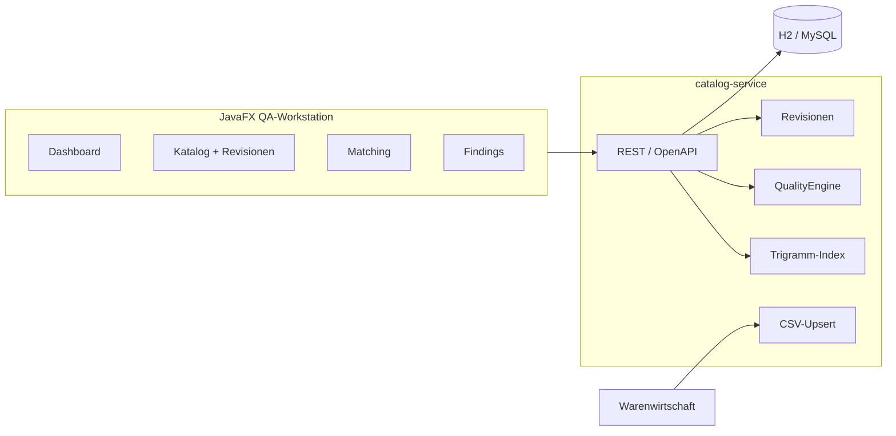

# PharmaIndex

Stammdatenplattform für Fertigarzneimittel: REST-Microservice, erklärbares Matching, Qualitätssicherung und JavaFX-QA-Workstation.

Synthetische Demodaten. Kein medizinischer Rat, keine Verbindung zu kommerziellen Arzneimitteldatenbanken.

[](https://github.com/mdacoding/pharma-index/actions/workflows/ci.yml)


---

## Live Demo

| | |
|---|---|
| Einstieg / API-Landing | Nach Render-Free-Deploy: Root-URL des Services (Swagger unter `/swagger-ui.html`) |
| Demo-API-Key | `demo-partner-key` (Header `X-API-Key`) |
| JavaFX-Workstation | Lokal, siehe [Start](#start) |

Render Free-Tier kann nach Inaktivität einschlafen – der erste Request dauert dann 30–50 Sekunden. Die Demo nutzt **H2 im Speicher** (Seeder beim Start), es fällt keine Datenbankgebühr an.

Schnelltest nach dem Start: `POST /api/v1/match` mit `{"query":"Paracetmol HEXAL"}`.

---

## Portfolio-Nutzen

Gebaut für Java-Rollen im Apotheken- und Arzneimitteldatenumfeld (Webservices, UI, Algorithmen, B2B, QA, Skalierung).

In 10 Minuten zeigbar:

1. **Dashboard** – KPIs, Findings nach Schwere, ATC-Kapitel
2. **Matching** – `Paracetmol HEXAL` findet Paracetamol, inkl. Begründung und Laufzeit
3. **Qualitätssicherung** – ungültige PZN, fehlender ATC, Dubletten, Preisausreißer
4. **Katalog** – PZN-Lookup, ATC-Gruppe, Stammdaten-Revisionen
5. **B2B** – Semikolon-CSV, API-Key, **idempotenter Upsert**

| Anforderung | Umsetzung |
|---|---|
| Webservices | REST `/api/v1`, OpenAPI, RFC-7807 |
| UI-Anwendungen | JavaFX (Dashboard, Katalog, Matching, QA) |
| Algorithmen für Arzneimitteldaten | PZN-Prüfziffer, Trigramm-Index, Levenshtein, ATC-Kapitel |
| B2B-Schnittstellen | Partner-API-Key, CSV-Import, Upsert, Import-Jobs |
| Qualitätssicherung | Regelwerk + persistierte Findings + CSV-Export |
| Serverskalierung | Cache, Paginierung, Actuator/Prometheus, Rate-Limit, Matching-Health |
| Spring Boot, Hibernate, relationale DB | JPA + Flyway, H2 (Demo) / MySQL-Profil |

## Architektur



## Start

JDK 21, Maven. Keine Cloud, keine bezahlten APIs.

```powershell
.\scripts\start-api.ps1
```

- Landing: http://localhost:8080
- Swagger: http://localhost:8080/swagger-ui.html
- Header `X-API-Key`: `demo-partner-key`
- Health: http://localhost:8080/actuator/health

Zweites Terminal:

```powershell
.\scripts\start-ui.ps1
```

MySQL lokal (optional):

```bash
mvn -pl catalog-service spring-boot:run -Dspring-boot.run.profiles=mysql
```

## API

| Methode | Pfad | Zweck |
|---|---|---|
| GET | `/api/v1/ops/dashboard` | KPIs für Fachredaktion / Betrieb |
| GET | `/api/v1/products?q=&atc=` | Suche, paginiert |
| GET | `/api/v1/products/{pzn}` | Lookup (Cache) inkl. ATC-Kapitel |
| GET | `/api/v1/products/{pzn}/revisions` | Änderungshistorie |
| POST | `/api/v1/match` | Fuzzy-Match mit Score-Begründung |
| GET | `/api/v1/qa/findings` | Offene Findings |
| GET | `/api/v1/qa/findings.csv` | Export für Redaktion |
| POST | `/api/v1/qa/findings/{id}/resolve` | Finding schließen |
| POST | `/api/v1/b2b/imports` | Partner-CSV, Upsert per PZN |

```bash
curl -s -H "X-API-Key: demo-partner-key" http://localhost:8080/api/v1/ops/dashboard
curl -s -H "X-API-Key: demo-partner-key" -H "Content-Type: application/json" ^
  -d "{\"query\":\"Paracetmol HEXAL\"}" http://localhost:8080/api/v1/match
```

## Tests

```bash
mvn -pl catalog-service test
```

JaCoCo-Report: `catalog-service/target/site/jacoco/index.html`

## Deployment (Free Tier)

Wie beim Manchester-Triage-Monitor: GitHub Actions für CI, Render Free für die API.

1. Dieses Repo auf GitHub (bereits öffentlich).
2. [Render](https://render.com) → New → Blueprint → `render.yaml` wählen.
3. Health-Check: `/actuator/health`. Daten: H2 + Seeder, **keine** Extra-Datenbank.

Die JavaFX-Workstation bleibt eine Desktop-UI und wird nicht gehostet.

## Gesprächsleitfaden

- **PZN:** Gewichte 2–8, Summe mod 11, Rest 10 unzulässig – `PznChecksum`.
- **Matching:** invertierter Trigramm-Index (Kandidaten), dann Feinscoring; Response enthält Poolgröße, Dauer und Teilscores.
- **QA:** Findings sind Datensätze, keine Logzeilen – so arbeitet Datenproduktion.
- **B2B:** Wiederholter Import derselben PZN ist ein Update, kein 409.
- **Skalierung:** PZN-Lookup über Caffeine, Listen pageable, Indexgröße im Health-Endpoint.

## Lizenz

MIT
