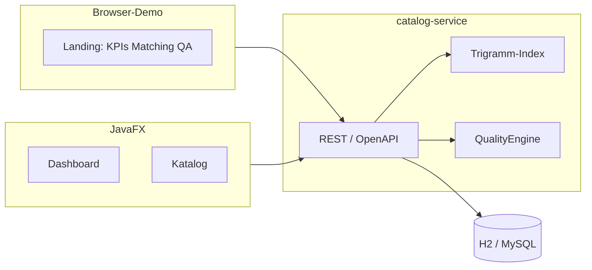

# PharmaIndex

Stammdatenplattform für Fertigarzneimittel – **Katalog, Matching, Qualitätssicherung** und eine JavaFX-QA-Workstation. Gebaut wie ein Ausschnitt aus Datenproduktion, nicht als generisches CRUD.

Synthetische Demodaten. Kein medizinischer Rat, keine Verbindung zu kommerziellen Arzneimitteldatenbanken.

[](https://github.com/mdacoding/pharma-index/actions/workflows/ci.yml)


**Repo:** [github.com/mdacoding/pharma-index](https://github.com/mdacoding/pharma-index)  
**Texte für CV/LinkedIn:** [docs/portfolio-pitch.md](docs/portfolio-pitch.md)

---

## 30 Sekunden für Recruiter

1. Lokal `.\scripts\start-api.ps1` → [http://localhost:8080](http://localhost:8080)
2. Matching-Feld: **Paracetmol HEXAL** (Tippfehler) – Treffer inkl. Begründung und Millisekunden
3. Tabelle darunter: echte QA-Findings (ungültige PZN, fehlender ATC, Dublette, Preis)
4. Optional Desktop: `.\scripts\start-ui.ps1` (JavaFX: Dashboard, Katalog mit Revisionen, QA-Farben)

Schreiben (Import/Update) braucht Header `X-API-Key: demo-partner-key`. Lesen und Matching sind in der Demo absichtlich offen, damit Fachlogik ohne Setup sichtbar ist.

---

## Screenshots

| Live-Demo im Browser | Matching mit Score-Begründung |
|---|---|
|  |  |

> Bilder nach dem Start unter `docs/screenshots/` ablegen, falls sie in einem Clone fehlen: Startseite und Matching-Tabelle.

---

## Warum das für eine Fachabteilung zählt

| Thema | Entscheidung im Code |
|---|---|
| PZN | Prüfziffer Gewichte 2–8, mod 11, Rest 10 unzulässig (`PznChecksum`) |
| Matching | kein Full-Scan als Normalfall: Trigramm-Index, dann Feinscoring |
| QA | Findings persistiert, JavaFX als Redaktions-UI |
| B2B | CSV-Upsert, wiederholter Feed ist Update, kein 409 |
| Historie | jede Anlage/Änderung als Revision |
| Skalierung | Caffeine-Cache, Paginierung, Actuator inkl. Indexgröße, Prometheus |
| Demo vs. Produktion | öffentliche Reads nur für Portfolio; Writes hinter API-Key; MySQL-Profil vorhanden |

## Architektur



## Start

JDK 21, Maven.

```powershell
.\scripts\start-api.ps1
```

| | |
|---|---|
| Demo | http://localhost:8080 |
| Swagger | http://localhost:8080/swagger-ui.html |
| Health | http://localhost:8080/actuator/health |
| Write-Key | `demo-partner-key` |

```powershell
.\scripts\start-ui.ps1
```

## Tests

```bash
mvn -pl catalog-service test
```

## Deployment (optional, Free)

Kein Vercel – das ist Java, kein React-Frontend. Öffentliche API: Render Blueprint (`render.yaml`), H2 im Speicher, keine bezahlte Datenbank.

## Lizenz

MIT
