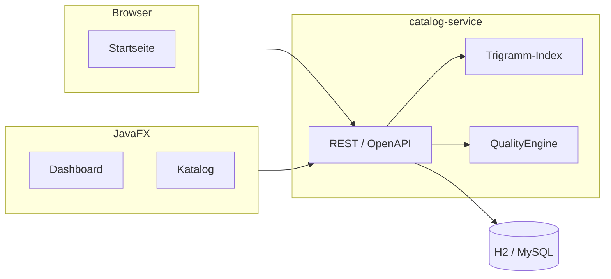

# PharmaIndex

Stammdatenplattform für Fertigarzneimittel: Katalog, Matching, Qualitätssicherung und JavaFX-QA-Workstation.

Synthetische Demodaten. Kein medizinischer Rat, keine Verbindung zu kommerziellen Arzneimitteldatenbanken.

[](https://github.com/mdacoding/pharma-index/actions/workflows/ci.yml)
[](https://pharma-index-api.onrender.com)


---

## Live-Demo

| | |
|---|---|
| Anwendung | https://pharma-index-api.onrender.com |
| OpenAPI | https://pharma-index-api.onrender.com/swagger-ui.html |
| Health | https://pharma-index-api.onrender.com/actuator/health |
| Schreibender Zugriff | Header `X-API-Key: demo-partner-key` |

Render Free schläft nach 15 Minuten Idle; der erste Request danach dauert etwa eine Minute. H2 ist flüchtig – beim Aufwachen wird der Katalog neu geladen.

---

## Überblick

Die Anwendung bildet typische Schritte der Stammdatenpflege ab: PZN-Lookup, unscharfe Zuordnung von Freitext (Warenwirtschaft/Scan), Qualitätsregeln und Änderungshistorie. Partnerimporte laufen als Upsert über die PZN.

In der Demo sind Lesen und Matching ohne API-Key nutzbar. Anlegen, Ändern und CSV-Import erfordern `X-API-Key`.

## Schnellstart

JDK 21, Maven.

```powershell
.\scripts\start-api.ps1
```

| | |
|---|---|
| Anwendung | http://localhost:8080 |
| OpenAPI | http://localhost:8080/swagger-ui.html |
| Health | http://localhost:8080/actuator/health |
| Schreibender Zugriff | Header `X-API-Key: demo-partner-key` |

Beispiel im Matching-Feld: `Paracetmol HEXAL` (Tippfehler). Desktop-UI:

```powershell
.\scripts\start-ui.ps1
```

## Screenshots

| Startseite | Matching und QA |
|---|---|
|  |  |

## Fachliche Entscheidungen

| Thema | Umsetzung |
|---|---|
| PZN | Prüfziffer Gewichte 2–8, Summe mod 11, Rest 10 unzulässig (`PznChecksum`) |
| Matching | Trigramm-Index für Kandidaten, danach Feinscoring (Levenshtein, Tokens, ATC-/Wirkstoff-Boost) |
| Qualitätssicherung | Findings als Datensätze; JavaFX-Oberfläche zur Bearbeitung |
| B2B | Semikolon-CSV, wiederholter Import aktualisiert denselben Stammsatz |
| Historie | Anlage und Änderung als Revision |
| Betrieb | Caffeine-Cache, Paginierung, Actuator (inkl. Indexgröße), Prometheus |
| Demo vs. Betrieb | öffentliche Reads nur lokal/Demo; Writes hinter API-Key; MySQL-Profil vorhanden |

## Architektur



## Tests

```bash
mvn -pl catalog-service test
```

## Deployment

Kein Vercel: das Backend ist Java. Live auf Render Free über `render.yaml` (Docker, H2 im Speicher, keine bezahlte Datenbank, Budget $0).

[](https://render.com/deploy?repo=https://github.com/mdacoding/pharma-index)

Push auf `main` löst Auto-Deploy aus.

## Lizenz

MIT
