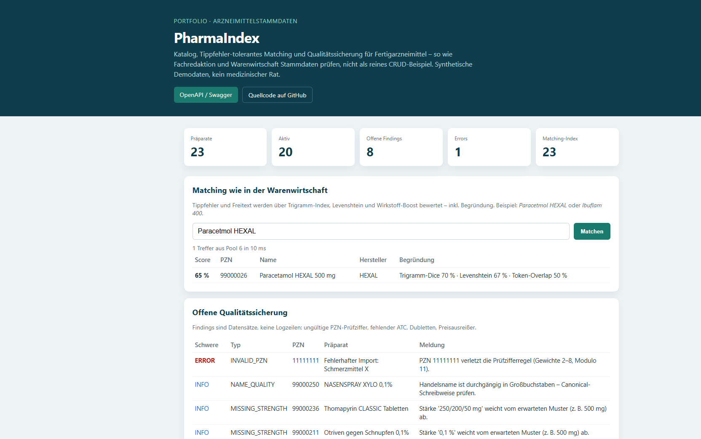
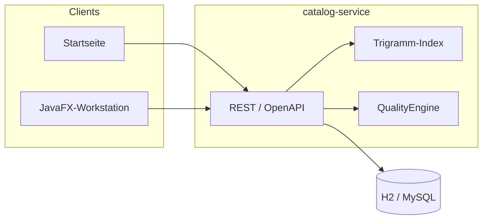

# PharmaIndex

Katalog, Matching und Qualitätssicherung für Fertigarzneimittel.

Die Anwendung bildet die Arbeit mit Arzneimittelstammdaten ab: eine Pharmazentralnummer muss stimmen, Freitext aus der Warenwirtschaft soll das richtige Präparat treffen, und Qualitätsmängel sind Vorgänge – keine Logzeilen. Partnerlieferungen laufen als CSV-Upsert über die PZN.

Synthetische Demodaten. Kein medizinischer Rat, keine Verbindung zu kommerziellen Arzneimitteldatenbanken.

[](https://github.com/mdacoding/pharma-index/actions/workflows/ci.yml)
[](https://pharma-index-api.onrender.com)


## Live-Demo

| | |
|---|---|
| Anwendung | https://pharma-index-api.onrender.com |
| OpenAPI | https://pharma-index-api.onrender.com/swagger-ui.html |
| Health | https://pharma-index-api.onrender.com/actuator/health |

Auf der Startseite liegen Katalogzahlen, ein Matching-Feld und offene QA-Findings. Lesen und Matching brauchen keinen Schlüssel. Anlegen, Ändern, CSV-Import und QA-Scan: Header `X-API-Key: demo-partner-key`.

Tippfehler zum Ausprobieren: `Paracetmol HEXAL`.

Die Instanz läuft auf Render Free und schläft nach 15 Minuten ohne Traffic. Der erste Request danach dauert etwa eine Minute; H2 startet leer und wird neu befüllt.

## Screenshots

| Startseite | Matching und QA |
|---|---|
|  |  |

## Fachlogik

| Thema | Regel |
|---|---|
| PZN-8 | Stamm 7 Ziffern × Gewichte 2–8, Prüfziffer = Summe mod 11, Rest 10 unzulässig (`PznChecksum`) |
| Matching | Invertierter Trigramm-Index wählt Kandidaten; Feinscoring aus Levenshtein, Token-Überlappung, ATC- und Wirkstoff-Boost – mit Begründung |
| Qualitätssicherung | Findings als Datensätze (ungültige PZN, ATC, Stärke, Preis, Dubletten); Abarbeitung in der JavaFX-Workstation |
| B2B-Import | Semikolon-CSV, UTF-8; wiederholter Import aktualisiert denselben Stammsatz über die PZN |
| Historie | Jede Anlage und Änderung als Revision |
| Betrieb | Caffeine-Cache, Paginierung, Actuator (inkl. Indexgröße), Prometheus, Rate-Limit, Korrelations-ID |

Die Demo gibt Reads frei, damit Matching und QA im Browser sichtbar sind. Schreibende Endpunkte bleiben hinter dem API-Key. Für persistente Daten gibt es ein MySQL-Profil (`application-mysql.yml`).

## Architektur

Zwei Maven-Module: `catalog-service` (Spring Boot 3.4, Java 21) und `qa-workstation` (JavaFX 21).



| Modul | Aufgabe |
|---|---|
| `catalog-service` | REST-Katalog, Matching, QA-Regelwerk, B2B-Import, Flyway, Hibernate |
| `qa-workstation` | Desktop-Arbeitsplatz: Dashboard, Katalog, Matching, Findings |

## API

| Methode | Pfad | Auth |
|---|---|---|
| `GET` | `/api/v1/products`, `/api/v1/products/{pzn}` | offen |
| `GET` | `/api/v1/products/{pzn}/revisions` | offen |
| `POST` | `/api/v1/match` | offen |
| `GET` | `/api/v1/qa/findings`, `/api/v1/ops/dashboard` | offen |
| `POST` / `PUT` | `/api/v1/products` | `X-API-Key` |
| `POST` | `/api/v1/b2b/imports` | `X-API-Key` |
| `POST` | `/api/v1/qa/scan` | `X-API-Key` |

Vollständige Beschreibung: [OpenAPI](https://pharma-index-api.onrender.com/swagger-ui.html).

## Lokal starten

JDK 21 und Maven.

```powershell
.\scripts\start-api.ps1
```

| | |
|---|---|
| Anwendung | http://localhost:8080 |
| OpenAPI | http://localhost:8080/swagger-ui.html |
| Health | http://localhost:8080/actuator/health |

JavaFX-Workstation, sobald die API läuft:

```powershell
.\scripts\start-ui.ps1
```

## Tests

```bash
mvn -pl catalog-service test
```

## Deployment

Docker-Image. `render.yaml` beschreibt den Render-Free-Service (H2 im Speicher, Health-Check `/actuator/health`). Push auf `main` löst Auto-Deploy aus.

## Lizenz

MIT
